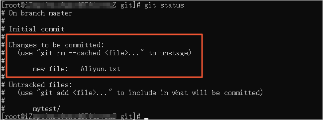
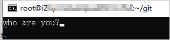

# git init

执行如下命令，使用当前目录作为Git仓库，进行初始化。该命令执行完后会在当前目录生成一个.git 目录。

```
git init
```


e. 执行如下命令，查看生成的.git的目录。

```
ls -lA
```

# 使用git clone克隆远程仓库。

您可以使用git clone从现有Git仓库中拷贝项目（类似svn checkout）。

克隆仓库的命令格式如下。

```
git clone <repo> <directory>
```


参数说明：

- repo：Git仓库地址。
- directory：本地目录。

Git本地仓库有三大区域：工作区、暂存区、版本区。创建、修改文件等操作是在工作区，git add命令是将工作区的内容添加到暂存区，git commit命令将临时存区内容添加到本地仓库中。

# git add命令语法如下。

添加一个或多个文件到暂存区。

```
git add [file1][file2]...
```


添加指定目录到暂存区，包括子目录。

```
git add [dir]
```


添加当前目录下的所有文件到暂存区。

```
git add .
```


# git commit命令语法如下。

提交暂存区到本地仓库中。

```
git commit -m 'message'
```

[VSCode中使用Git提交代码_vscode提交git-CSDN博客](https://blog.csdn.net/mo_sss/article/details/132555082?utm_medium=distribute.pc_relevant.none-task-blog-2~default~baidujs_baidulandingword~default-0-132555082-blog-109305995.235^v43^pc_blog_bottom_relevance_base8&spm=1001.2101.3001.4242.1&utm_relevant_index=3)

参数说明：

- -m：添加-m参数表示可以直接输入后面的message，如果不加-m参数，表示不直接输入message的，而是会调用一个编辑器来让您输入这个message。
- message：备注信息。

\3. 提交暂存区的指定文件到仓库区。

```
git commit [file1] [file2] ... -m 'message'
```


a. 执行如下命令，进入git目录。

```
cd /root/git
```


b. 执行如下命令，编写一个Aliyun.txt文件。

```
vim /root/git/Aliyun.txt
```


进入Vim编辑器后，按下i键进入编辑模式。添加以下内容，添加完成后按下Esc键退出编辑模式，最后输入：wq后按下Enter键保存并退出Vim编辑器。

```
Welcome to Aliyun！！！
```


添加后的文件内容如下所示。


c. 执行如下命令，将Aliyun.txt文件提交到暂存区。

```
git add Aliyun.txt
```

# git  remote add origin +...

与网站上的库建立连接：


```
git remote addd origin 复制的东西
```

然后会提示输入github账号密码，账号是用户名，如实输入，密码需要使用自己的token，而非自己设置的密码，token的获取参考以下网址：
[2021.8.13起，Github要求使用基于令牌的身份验证 - 知乎 (zhihu.com)](https://zhuanlan.zhihu.com/p/401978754)

（linux系统复制token时无可见符号，不要重复多次复制）

# git push

命令格式如下：

```
git push <远程主机名> <本地分支名>:<远程分支名>
```

如果本地分支名与远程分支名相同，则可以省略冒号：

```
git push <远程主机名> <本地分支名>
```

以下命令将本地的 master 分支推送到 origin 主机的 master 分支。

```
git push origin master
```


# git status

d. 执行如下命令，查看当前仓库文件状态。

```
git status
```


返回结果如下，您可以跟踪到新的文件Aliyun.txt。



e. 执行如下命令，将Aliyun.txt文件提交到git仓库。

```
git commit -m 'wrote a new file'
```


返回结果如下，表示您已将Aliyun.txt文件成功提交到仓库。


f. 执行如下命令，再次查看仓库状态后，返回结果表示无任何内容新增或修改。

```
git status
```


# Git版本回退
## git reset命令

用于回退版本，可以指定退回某一次提交的版本。git reset命令语法如下。

git reset [--soft | --mixed | --hard] [HEAD]
参数说明：

--mixed：默认，可以不用带该参数。用于重置暂存区的文件，使文件与上一次的提交(commit)保持一致，工作区文件内容保持不变。
--soft：用于回退到某个版本。
--hard：参数用于撤销工作区中所有未提交的修改内容，将暂存区与工作区都回到上一次版本，并删除之前的所有信息提交。
HEAD：
HEAD和HEAD~0表示当前版本。

HEAD^和HEAD~1表示上一个版本。

HEAD^^和HEAD^2表示上上一个版本。

HEAD^^^和HEAD^3表示上上上一个版本。

其他版本以此类推...

1. 执行如下命令，修改Aliyun.txt文件。

vim /root/git/Aliyun.txt
进入Vim编辑器后，按下i键进入编辑模式。添加以下内容，添加完成后按下Esc键退出编辑模式。最后输入:wq后按下Enter键保存并退出Vim编辑器。

wrote a new file


2. 执行如下命令，将Aliyun.txt文件提交到暂存区。

git add Aliyun.txt
3. 执行如下命令，将Aliyun.txt文件提交到git仓库。

git commit -m 'more a file'
4. 执行如下命令，查看历史提交记录。

git log
返回结果如下，您可以看到两条提交日志记录。


5. 执行如下命令，将Aliyun.txt回退到wrote a file版本。

git reset --hard HEAD^


# 6. Git的文件比较

git diff命令用于比较文件的不同，即比较文件在暂存区和工作区的差异。git diff命令显示已写入暂存区和已经被修改但尚未写入暂存区文件的区别。git diff的语法如下。

查看尚未缓存的改动。

```
git diff
```


查看已缓存的改动。

```
git diff --cached
```


查看已缓存的与未缓存的所有改动。

```
git diff HEAD
```


显示摘要，而非整个diff。

```
git diff --stat
```


\1. 执行如下命令，修改Aliyun.txt文件。

```
vim /root/git/Aliyun.txt
```


进入Vim编辑器后，按下i键进入编辑模式。修改为以下内容，添加完成后按下Esc键退出编辑模式。最后输入**:wq**后按下Enter键保存并退出Vim编辑器。

```
wrote a new file
this is two new file
this is three new file
```


\2. 执行如下命令，将修改的Aliyun.txt文件添加到暂存区。

```
git add Aliyun.txt
```


\3. 执行如下命令，查看仓库状态。

```
git status
```


返回结果如下，您可以看见有需要提交的更改文件。


\4. 执行如下命令，再次修改Aliyun.txt文件。

```
vim /root/git/Aliyun.txt
```


进入Vim编辑器后，按下i键进入编辑模式，添加以下内容，添加完成后按下Esc键退出编辑模式，最后输入:wq后按下Enter键保存并退出Vim编辑器。

```
this is four new file
```


添加后的文件内容如下所示。


\5. 执行如下命令，查看仓库状态。

```
git status
```


返回结果如下，表示暂存区有尚未提交的文件变更。


\6. 执行如下命令，将Aliyun.txt文件提交到git仓库。

```
git commit -m 'four new file'
```


\7. 执行如下命令，查看仓库状态。

```
git status
```


返回结果如下，您可以看见第二次修改的文件没有被提交。


\8. 执行如下命令，查看工作区和版本库里面最新版本的区别。

```
git diff HEAD -- Aliyun.txt
```

# 7. Git的撤销修改

Git的撤销修改有以下两种方式。

\1. 文件修改后还没有被放到暂存区，撤销修改就能回到版本库未修改前状态。

a. 执行如下命令，查看原Aliyun.txt文件内容。

```
cat Aliyun.txt
```


返回结果如下。


b. 执行如下命令，修改Aliyun.txt文件。

```
vim /root/git/Aliyun.txt
```


进入Vim编辑器后，按下i键进入编辑模式，添加以下内容，添加完成后按下Esc键退出编辑模式，最后输入**:wq**后按下Enter键保存并退出Vim编辑器。

```
第一次修改
```


添加后的文件内容如下所示。


c. 执行如下命令，查看修改后Aliyun.txt文件内容。

```
cat Aliyun.txt
```


返回结果如下，您可以看见您修改后文件的内容。


## d. 执行如下命令，撤销对Aliyun.txt文件的修改。

```
git checkout Aliyun.txt
```


e. 执行如下命令，查看Aliyun.txt文件内容。

```
cat Aliyun.txt
```


返回结果如下，您可以看见您新增后没有提交到暂存区的内容已经被撤销。


\2. 文件修改后添加到暂存区，撤销暂存区的修改就回到添加到暂存区后的状态，需要继续执行撤销文件操作，才能完全撤销成功。

a. 执行如下命令，查看原Aliyun.txt文件内容。

```
cat Aliyun.txt
```


返回结果如下。


b. 执行如下命令，修改Aliyun.txt文件。

```
vim /root/git/Aliyun.txt
```


进入Vim编辑器后，按下i键进入编辑模式，添加以下内容，添加完成后按下Esc键退出编辑模式，最后输入:wq后按下Enter键保存并退出Vim编辑器。

```
第二次修改
```


添加后的文件内容如下所示。


c. 执行如下命令，查看修改后Aliyun.txt文件内容。

```
cat Aliyun.txt
```


返回结果如下，您可以看见您修改后文件的内容。


## d. 执行如下命令，将修改的Aliyun.txt文件提交到暂存区。

```
git add Aliyun.txt
```


## e. 执行如下命令，在暂存区取消对Aliyun.txt文件暂存区的更改。

```
git reset HEAD Aliyun.txt
```


## f. 执行如下命令，撤销文件。

```
git checkout Aliyun.txt
```


g. 执行如下命令，查看Aliyun.txt文件内容是否被成功修改。

```
cat Aliyun.txt
```


返回结果如下，您可以看到提交到暂存区的内容已经被撤销。


# 8. Git的删除文件

Git的删除方式有两种，如下。

误删除工作区的文件

a. 执行如下命令，查看git目录下所有文件。

```
ls
```


返回结果如下，您可以看到git目录下所有文件。


b. 执行如下命令，误删除工作区Aliyun.txt文件。

```
rm -rf Aliyun.txt
```


c. 执行如下命令，查看仓库有一条删除文件的记录。

```
git status
```


返回结果如下，您可以看到仓库有一条删除文件的记录。


d. 执行如下命令，撤销文件删除操作。

```
git checkout Aliyun.txt
```


e. 执行如下命令，查看已经没有删除文件的状态。

```
git status
```


直接删除不需要的文件。

执行如下命令，从仓库中删除Aliyun.txt文件。

```
git rm Aliyun.txt
```


b. 执行如下命令，将删除操作提交到仓库。

```
git commit -m 'delete Aliyun.txt'
```


返回结果如下。


c. 执行如下命令，查看文件是否被删除。

```
ls
```


返回结果如下，您可以看到文件已经被删除。


d. 执行如下命令，再次查看仓库状态git status，您可以看到在暂存区删除的文件已经提交。


# 9. Git分支管理

\1. 查看分支。

执行如下命令，查看分支。

```
git branch
```


## 2. 创建分支。

执行如下命令，创建分支。

```
git branch test
```


## 3. 切换分支。

a. 执行如下命令，切换分支。

```
git checkout test
```


b. 执行如下命令，查看分支是否已经切换。

```
git branch
```


返回结果如下，您可以看到已经成功切换到test分支。


## 4. 创建并切换分支。

a. 执行如下命令，您可以实现创建分支并切换分支。

```
git checkout -b test2
```


b. 执行如下命令，查看分支是否已经切换。

```
git branch
```


返回结果如下，您可以看到已经成功切换到test2分支。


## 5. 删除分支。

a. 执行如下命令，删除分支。

**注意:**如果您要删除的分支是当前工作分支，必须切换到其他分支后，才能删除。

```
git branch -d test
```


执行如下命令，查看分支是否已经切换。

```
git branch
```


## 6. 合并分支。

a. 执行如下命令，查看当前所处分支。

```
git branch
```


返回结果如下。


b. 执行如下命令，在当前分支test2下新建test2.txt文件

```
vim test2.txt
```


进入Vim编辑器后，按下i键进入编辑模式，添加以下内容，添加完成后按下Esc键退出编辑模式，最后输入**:wq**后按下Enter键保存并退出Vim编辑器。

```
who are you?
```


添加后的文件内容如下所示。



c. 执行如下命令，将文件提交到暂存区。

```
git add test2.txt
```


d. 执行如下命令，将暂存区内容提交到本地仓库。

```
git commit -m 'test2分支新文件'
```


返回结果如下，您可看到test2.txt已经成功提交到本地仓库。


e. 执行如下命令，切换到master分支。

```
git checkout master
```


f. 执行如下命令，查看master分支下所有文件。

**注意:**不能跨分支查看其他分支的文件。

```
ls
```


## g. 执行如下命令，将test2分支合并到当前master分支。

```
git merge test2
```


返回结果如下，您可以看到分支合并成功。


h. 执行如下命令，查看master分支下是否包含test2.txt文件。

```
ls
```


返回结果如下，您可以看到master分支下有test2.txt文件。


[保姆级教程 | Merge Request 分支合并请求 - 知乎 (zhihu.com)](https://zhuanlan.zhihu.com/p/431865877)

[git命令行登陆github进行操作 - 简书 (jianshu.com)](https://www.jianshu.com/p/6e3f9e4e8e69)

[(10 封私信 / 82 条消息) VMware虚拟机怎么使用主机代理？ - 知乎 (zhihu.com)](https://www.zhihu.com/question/495148700?utm_id=0)

[ssh密钥连接时出现sign_and_send_pubkey: *****from agent: agent refused operation问题的解决办法_signingfailed for rsa-CSDN博客](https://blog.csdn.net/qq_44018692/article/details/119699316)