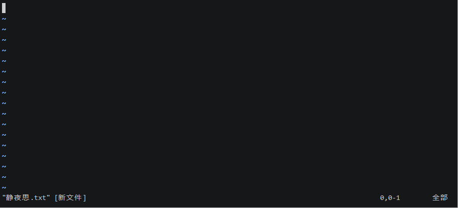
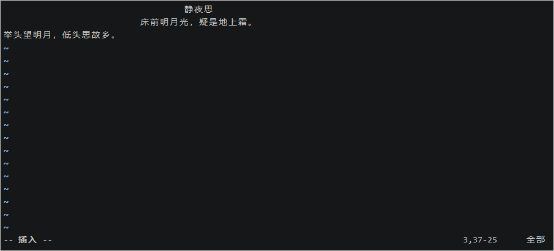
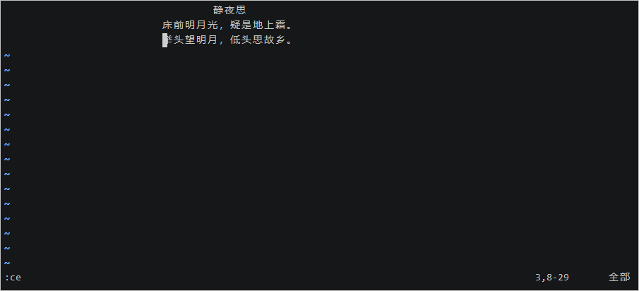

## 文本编辑工具Vim

### vim的三种操作模式

vim有三种操作模式，分别是命令模式（Command mode）、输入模式（Insert mode）和底线命令模式（Last line mode）。

三种模式切换快捷键：

| 模式         | 快捷键 |
| ------------ | ------ |
| 命令模式     | ESC    |
| 输入模式     | i或a   |
| 底线命令模式 | :      |

- 命令模式

在命令模式中控制光标移动和输入命令，可对文本进行复制、粘贴、删除和查找等工作。

使用命令vim filename后进入编辑器视图后，默认模式就是命令模式，此时敲击键盘字母会被识别为一个命令，例如在键盘上连续敲击两次d，就会删除光标所在行。

以下是在命令模式中常用的快捷操作：

| 操作                                                         | 快捷键               |
| :----------------------------------------------------------- | -------------------- |
| 光标左移                                                     | h                    |
| 光标右移                                                     | l（小写L）           |
| 光标上移                                                     | k                    |
| 光标下移                                                     | j                    |
| 光标移动到下一个单词                                         | w                    |
| 光标移动到上一个单词                                         | b                    |
| 移动游标到第n行                                              | nG                   |
| 移动游标到第一行                                             | gg                   |
| 移动游标到最后一行                                           | G                    |
| 快速回到上一次光标所在位置                                   | Ctrl+o               |
| 删除当前字符                                                 | x                    |
| 删除前一个字符                                               | X                    |
| 删除整行                                                     | dd                   |
| 删除一个单词                                                 | dw或daw              |
| 删除至行尾                                                   | d$或D                |
| 删除至行首                                                   | d^                   |
| 删除到文档末尾                                               | dG                   |
| 删除至文档首部                                               | d1G                  |
| 删除n行                                                      | ndd                  |
| 删除n个连续字符                                              | nx                   |
| 将光标所在位置字母变成大写或小写                             | ~                    |
| 复制游标所在的整行                                           | yy（3yy表示复制3行） |
| 粘贴至光标后（下）                                           | p                    |
| 粘贴至光标前（上）                                           | P                    |
| 剪切                                                         | dd                   |
| 交换上下行                                                   | ddp                  |
| 替换整行，即删除游标所在行并进入插入模式                     | cc                   |
| 撤销一次或n次操作                                            | u{n}                 |
| 撤销当前行的所有修改                                         | U                    |
| 恢复撤销操作                                                 | Ctrl+r               |
| 整行将向右缩进                                               | >>                   |
| 整行将向左退回                                               | <<                   |
| 若档案没有更动，则不储存离开，若档案已经被更动过，则储存后离开 | ZZ                   |

- 输入模式

在命令模式下按i或a键就进入了输入模式，在输入模式下，您可以正常的使用键盘按键对文本进行插入和删除等操作。

- 底线命令模式

在命令模式下按:键就进入了底线命令模式，在底线命令模式中可以输入单个或多个字符的命令。

| 操作                                                       | 命令                                    |
| ---------------------------------------------------------- | --------------------------------------- |
| 保存                                                       | :w                                      |
| 退出                                                       | :q                                      |
| 保存并退出                                                 | :wq（:wq!表示强制保存退出）             |
| 将文件另存为其他文件名                                     | :w new_filename                         |
| 显示行号                                                   | :set nu                                 |
| 取消行号                                                   | :set nonu                               |
| 使本行内容居中                                             | :ce                                     |
| 使本行文本靠右                                             | :ri                                     |
| 使本行内容靠左                                             | :le                                     |
| 向光标之下寻找一个名称为word的字符串                       | :/word                                  |
| 向光标之上寻找一个字符串名称为word的字符串                 | :?word                                  |
| 重复前一个搜寻的动作                                       | :n                                      |
| 从第一行到最后一行寻找word1字符串，并将该字符串取代为word2 | :1,$s/word1/word2/g或 :%s/word1/word2/g |

### 使用示例

在本示例将使用vim在文本文件中写入一首唐诗。

\1. 新建一个文件并进入vim命令模式（因为涉及中文需要您自行点击右下角进行中英文切换）。

```
vim 静夜思.txt
```




\2. 按下i进入输入模式，输入《静夜思》的诗名。


\3. 按下ECS键回到命令模式，并输入底线命令:ce，使诗名居中。


\4. 按下o键换行并进入输入模式，输入第一行诗。


\5. 按下ECS键回到命令模式，并输入底线命令:ce，使第一行诗居中。


\6. 按下o键换行并进入输入模式，输入第二行诗。



\7. 按下ECS键回到命令模式，并输入底线命令:ce，使第二行诗居中。



\8. 在命令模式中执行底线命令:wq离开vim。

